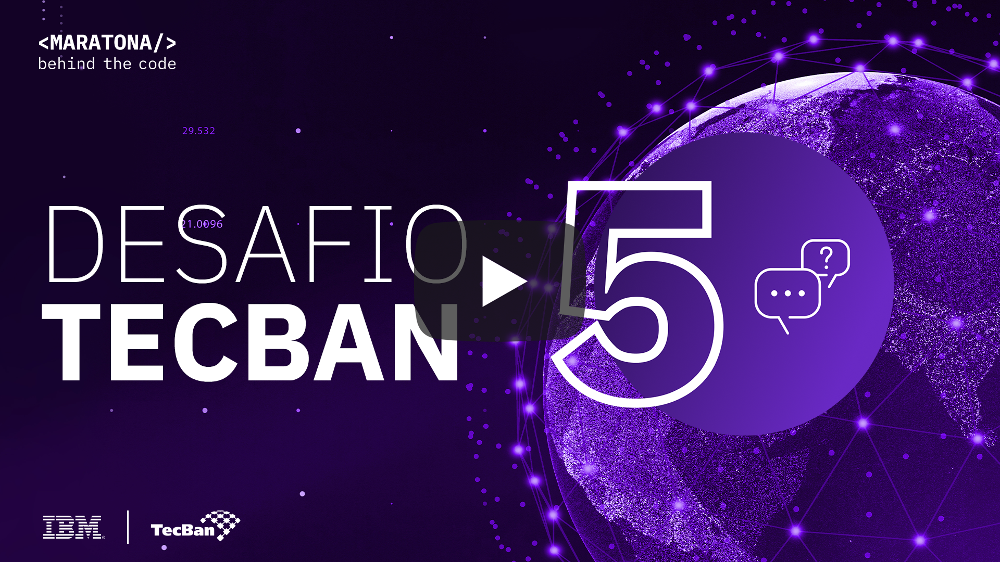
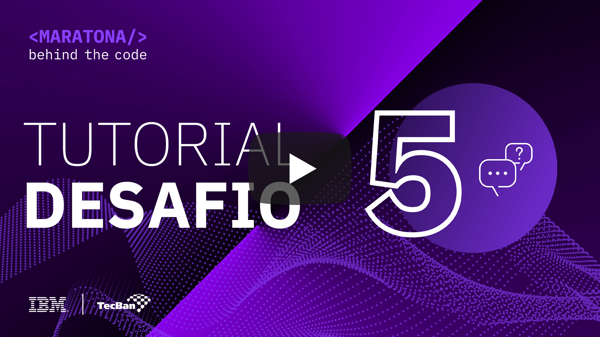
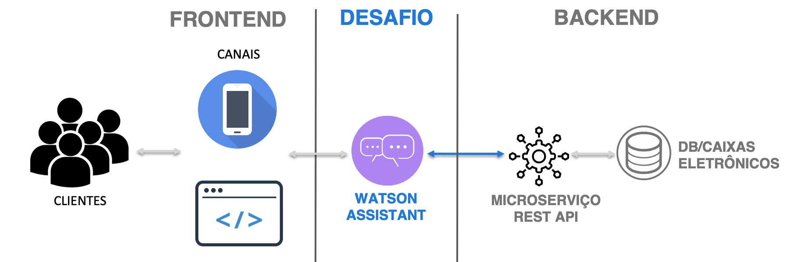
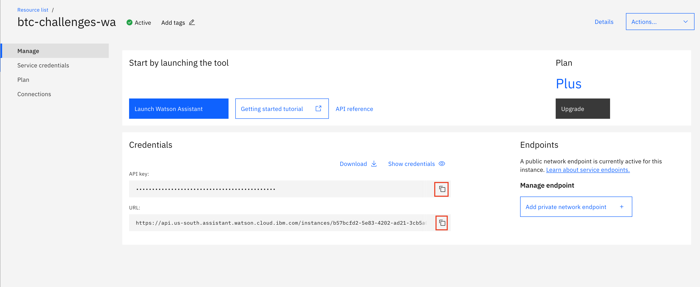
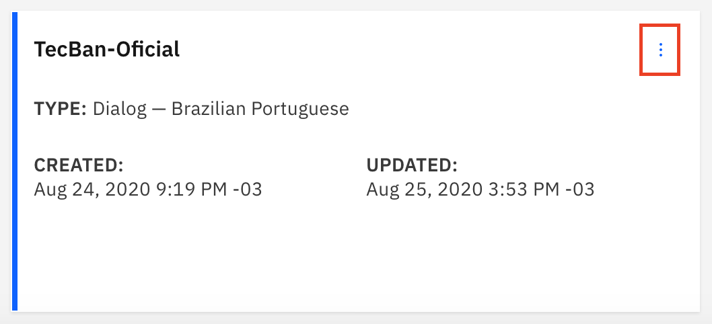
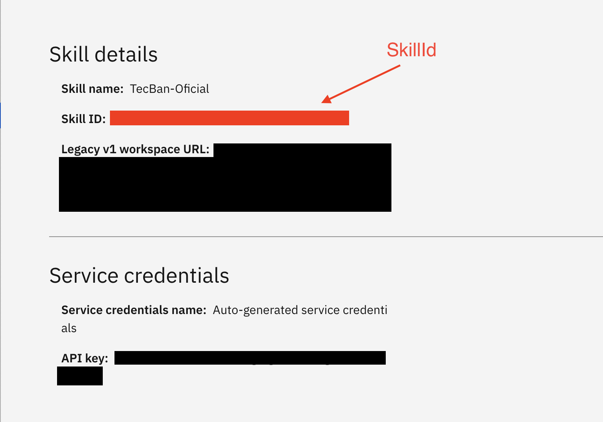
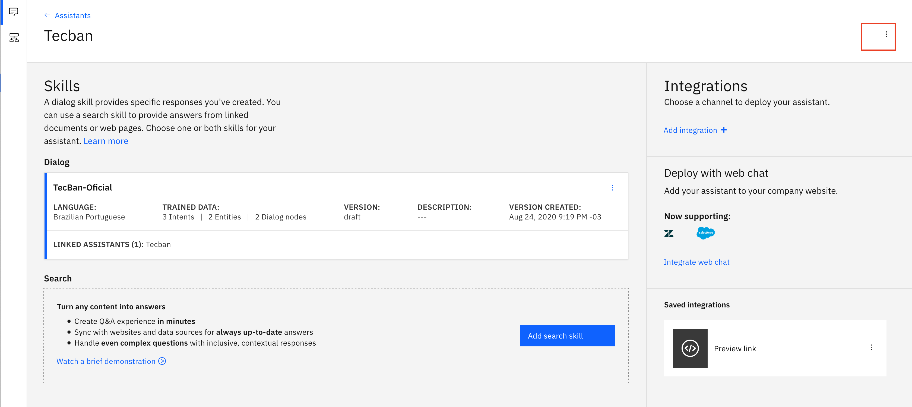
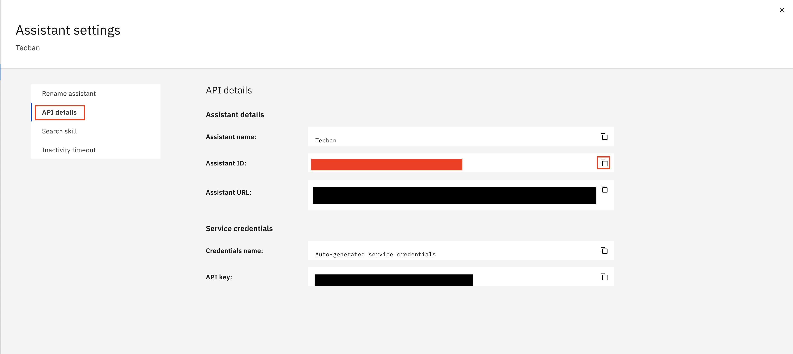

[](https://cloud.ibm.com)
<a href="https://discord.gg/2NRPpcU">
</a>

# Desafio 05 | Tecban

- [1. Sobre a Tecban](#1-sobre-a-tecban)
- [2. Desafio de negócio](#2-desafio-de-negocio)
- [3. Objetivo](#3-objetivo)
- [4. Desenvolvendo a Solução](#4-desenvolvendo-a-solucao)
  - [4.1. Pré-requisitos](#41-pré-requisitos)
  - [4.2. Sobre o Watson Assistant](#42-sobre-o-watson-assistant)
  - [4.3. Resumo das tarefas](#43-resumo-das-tarefas)
  - [4.4. Desenvolvimento](#44-desenvolvimento)
- [5. Submissão](#5-submissão)
- [6. Sobre a avaliação](#6-sobre-a-avaliação)

## Para te ajudar

- [Material de Apoio](#material-de-apoio)
- [Em caso de dúvidas](#em-caso-de-duvidas)
- [License](#license)

## 1. Sobre a Tecban

A TecBan faz acontecer, com expertise, tecnologia e inovações que há 38 anos garantem um ecossistema financeiro eficiente para a distribuição do dinheiro (físico e digital) no Brasil.  A empresa atua como uma plataforma aberta e interoperável com mais de 100 instituições financeiras e fintechs conectadas ao Banco24Horas, cuja estrutura conta com mais de 23 mil caixas eletrônicos distribuídos em todo o país.
Nos últimos 10 anos, a companhia investiu R$ 3 bilhões no desenvolvimento de produtos e soluções que vão além do Banco24Horas, oferecendo inovação e ajudando a integrar o mundo físico e digital.  O relançamento do serviço que permite sacar dinheiro diretamente no comércio é um dos últimos resultados desses investimentos. A solução permite concluir a transação pela maquininha, token, código QR, totem ou outros meios que a loja tiver disponível.
Diante de toda a capilaridade oferecida pela tecnologia, seria interessante contar com um assistente virtual para encontrar o melhor local para sacar dinheiro, seja uma ATM ou um ponto comercial (farmácia, padaria, mercado, etc).
Atualmente, o assistente Téo, integrado ao site e aplicativo do Banco24Horas, já auxilia os clientes no esclarecimento de dúvidas, abertura de chamados de atendimento e até mesmo com o mapa dos caixas eletrônicos mais próximos. Mas, assim como a TecBan está evoluindo com a oferta de novos serviços financeiros, o Téo também precisa evoluir para considerar os pontos de comércio disponíveis para quando o cliente precisar sacar dinheiro.

<div align="center">
    <a href="https://www.youtube.com/watch?v=rFPAJY7iL7k">
       
    </a>
</div>

## 2. Desafio de negócio

Oferecer ao cliente um assistente virtual que o auxilie a encontrar o melhor local para sacar seu dinheiro. O assistente deverá interagir com o cliente, respondendo a perguntas que consideram uma ou mais das seguintes condições:
- Localização: pontos mais próximos, de acordo com um raio de distância;
- Disponibilidade de um valor definido para saque: dependendo do valor requerido e dos tipos de notas disponíveis nos caixas eletrônicos próximos, pode-se concluir sobre a melhor recomendação: se em ATMs ou caixas de comércios;
- Tipo de ponto: Os saques podem considerar tanto ATMs como Comércios; 
- Tipo de comércio: o cliente pode preferir encontrar uma farmácia onde possa sacar e também comprar seus remédios. De forma similar, poderia preferir padarias ou supermercados;
A solução encontrará o ponto de atendimento mais próximo, conforme as necessidades do cliente, baseada nas respostas dadas ao assistente, e para os casos de comércio, caso haja alguma promoção registrada no sistema, será apresentada juntamente com os dados de endereço.

## 3. Objetivo

Neste desafio, você deverá utilizar a ferramenta da IBM de inteligência artificial aplicada a criação de assistentes virtuais, [Watson Assistant](https://cloud.ibm.com/catalog/services/watson-assistant), para criar um chatbot capaz de indicar qual o caixa eletrônico mais próximo da localização e se o valor solicitado está disponível para saque, bem como se o cliente prefere fazer diretamente em um ATM ou comércio, além de contar com níveis de interação básicos como saudações e finalizações de conversas.

Veja no vídeo abaixo uma explicação completa dos passos necessários para resolução desse desafio.

<div align="center">
    <a href="https://youtu.be/cotgT-G6WRE">
       
    </a>
</div>

## 4. Desenvolvendo a solução

### 4.1. Pré-requisitos

Para realizar esse desafio você deverá cumprir os seguintes pré-requisitos:

- Registrar-se na [Maratona Behind the Code](https://ibm.biz/maratona) e confirmar seu e-mail de cadastro.
- Possuir uma conta na [IBM Cloud](https://ibm.biz/registro-maratona), podendo ser a conta FREE ou pay-as-you-go (não é necessário registrar-se no evento com o mesmo e-mail utilizado para criar sua conta na IBM Cloud).

### 4.2. Visão geral da solução TecBan, com destaque ao proposto neste desafio (Watson Assistant)

<div align="center">
  <a href="#" target="_blank">
    
  </a>
</div>

Importante: Neste desafio, você desenvolverá o Assistente Virtual utilizando IBM Watson Assistant, e buscará as localizações utilizando micro-serviço (REST Api) disponível, conforme detalhes nos passos abaixo.

### 4.3. Resumo das tarefas

1. Instanciar o [Watson Assistant](https://cloud.ibm.com/catalog/services/watson-assistant);
2. Fazer o upload da skill fornecida no diretório [dataset](./doc/source/dataset);
3. Adicione mais exemplos as intenções de 'Saudacao', 'Finalizacao' e 'Saque';
4. Faça integração com a API `https://05062c6e.us-south.apigw.appdomain.cloud/btc/tecban` na aba de options do Watson Assistant;
5. Construa o diálogo com o tratamento adequado para cada situação. Mais informações na tabela abaixo;
6. Teste bastante seu assistente virtual
7. Quando se sentir confortavél acesse [https://tecban.maratona.dev](https://tecban.maratona.dev) e faça sua submissão.

### 4.4. Desenvolvimento

Para resolver esse desafio, será necessário primeiro instanciar o [Watson Assistant](https://cloud.ibm.com/catalog/services/watson-assistant). Uma vez com ele pronto para uso você deverá criar uma nova `skill` e deverá importar a fornecida no diretório [dataset](./doc/source/dataset). A `skill` fornecida já contem as intenções necessárias para resolução do desafio, contudo foi fornecido apenas um exemplo de cada intenção, sendo tarefa do particpante fornecer mais exemplos para aumentar a variabilidade e confiança na intenção correta.

Dentro da `skill` as entidades já foram preenchidas, e elas se referem ao locais onde o bot deve estar disponivel para uso, no caso, a cidade de Brasília. O participante não precisa alterar, adicionar ou remover as entidades presentes, pois isso pode gerar erros na validação.

Além de preencher as intenções com mais exemplos é tarefas do participante da Maratona construir o diálogo do assistente virtual. Serão avaliadas três grupos de interações.

Ao identificar a inteção de `Saudacao` o bot deve responder com uma saudação.

Ao identificar a intenção de `Finalizacao` o bot deve finalizar a conversa com uma despedida.

Ao identificar a inteção de `Saque` o bot deverá perguntar onde o usuário está. O usuário vai responder informando um dos locais presentes na entidade `Local`, por exemplo 'ASA NORTE'. Uma vez identificada a localização do usuário, o bot deve perguntar a quantia a ser sacada, e logo após o usuário responder a quantia pergutar se ele deseja sacar o dinheiro em algum tipo de comércio ou não. O usuário deve responder com um dos valores contidos na entidade `Segmento`. Em seguida bot deverá fazer uma requisição para a seguinte API:[https://05062c6e.us-south.apigw.appdomain.cloud/btc/tecban](https://05062c6e.us-south.apigw.appdomain.cloud/btc/tecban) com os seguintes parâmetros:

```json
{
  "bairro": "string",
  "quantia": 100,
  "segmento": "string"
}
```

A API responde de duas formas possíveis. Em caso de sucesso a resposta é a seguinte:

```json
{
  "err": false,
  "local": "string",
  "rua": "string",
  "numero": "string",
  "cep": "string",
  "promocao": "string"
}
```

No caso de erro a API responde no seguinte formato:

```json
{
  "err": true,
  "errMsg": "string"
}
```

Feita a requisição o bot deverá dar a resposta adequada em cada caso. Em caso de sucesso deverá informar o local onde a ATM está, seu endereço, número e cep, caso o usuário tenha escolhido sacar dentro de algum comércio, ou seja, um segmento que não seja ATM, o bot deve informar uma mensagem promocional sobre o lugar para o usuário. Em caso de erro na requisição, o usuário deve utilizar as mensagens de erros que a API retorna para dar o tratamento adequado.

Em resumo, seu assistente virtual precisa estar apto a receber essas três interações, adquirir as informações necessárias e fornecer as respostas adequadas. A tabela abaixo mostra o passo a passo do processo.

<div align="center">
  <table>
    <thead>
      <tr>
        <th>Interação</th>
        <th>Usuário</th>
        <th>Assistente Virtual</th>
        <th>API</th>
      </tr>
    </thead>
    <tbody>
      <tr>
        <td>1</td>
        <td>Bom dia</td>
        <td>Olá, sou assistente virtual capaz te dizer onde está a ATM mais próxima de você desde que esteja em Brasília-DF!</td>
        <td></td>
      </tr>
      <tr>
        <td>2</td>
        <td>Estou com pouco dinheiro no bolso e gosto de ter uns trocados, onde fica o caixa eletrônico mais próximo?</td>
        <td>Em qual bairro de Brasília você está?</td>
        <td></td>
      </tr>
      <tr>
        <td>3</td>
        <td>Estou na asa norte</td>
        <td>Quanto deseja sacar?<br></td>
        <td></td>
      </tr>
      <tr>
        <td>4</td>
        <td>Preciso de 80 reais</td>
        <td>Prefere sacar em algum supermercado, farmácia ou loja de conveniência ou qualquer ATM serve?</td>
        <td></td>
      </tr>
      <tr>
        <td>5<br></td>
        <td>Seria melhor no supermercado, pois preciso fazer uma compras<br></td>
        <td>O caixa mais próximo esta localizada no Supermercado X, na rua y, número 10 com o cep 00000-000.</td>
        <td>Aqui deve ser feita chamada da API e as informações sobre o estabelecimento que a ATM está localizada, rua, numero e cep são fornecidos pela API</td>
      </tr>
      <tr>
        <td>6<br></td>
        <td>Ok, obrigado</td>
        <td>Tchau volte sempre</td>
        <td></td>
      </tr>
    </tbody>
  </table>
</div>

Para mais detalhes veja o vídeo da seção acima.

Para este desafio tome cuidado com as varáveis de contexto que deverão ser utilizadas para salvar as informações sobre locais e quantias a serem sacadas

## 5. Submissão

Para realizar a submissão, primeiramente você deverá acessar a seguinte aplicação: https://tecban.maratona.dev/ e preencher o formulário com as credenciais de sua instância do **Watson Assistant**. Nessa página você será capaz de testar o seu modelo antes de submeter.

Abaixo estão imagens de onde encontrar as credenciais do Watson Assistant:
<div align="center">
  <h3> APIKEY e URL do Assisntant</h3>
  
  <h3>Na seção de skill, clique nos três pontos para pegar o skillId e em seguida em 'View API Details'</h3>
  
  <h3>SkillId</h3>
  
  <h3>Na seção dos assistentes crie um novo e ligue ele a sua skill da TecBan</h3>
  <h3>Assim que o assistant estiver criado clique no três pontos localizados no canto superior direito e clique em 'Settings'</h3>
  
  <h3> Em 'API details' copie seu assistantId</h3>
  
</div>

Com todas essas credenciais você está apto a submeter seu desafio.

🚨 **NÃO ESQUEÇA DE SUBMETER SUA SOLUÇÃO** 🚨

Após a realização dos testes, clique no botão no canto inferior direito para SUBMETER SUA SOLUÇÃO, conforme a imagem abaixo, e preencha o formulário com seu e-mail utilizado no registro na [MARATONA 2020](https://maratona.dev/pt).

</img>

## 6. Sobre a avaliação

O sistema testará se o assistente virtual identifica e responde adequadamente as `intents` de Saudacao, Finalizacao, Saque e se a chamada de API foi implementada corretamente. Sua pontuação será uma função que relaciona se a resposta obtida contem os elementos especificados acima e a confiança que o assistente tem nela.

## Material de apoio

- [Documentação completa do Watson Assistant, com boas práticas e mais](https://cloud.ibm.com/docs/assistant?topic=assistant-getting-started)

Você também pode acessar o discord oficial da Maratona 2020 para realizar perguntas e/ou interagir com outros participantes: [Discord](https://discord.gg/2NRPpcU).

## License

Copyright 2020 Maratona Behind the Code

Licensed under the Apache License, Version 2.0 (the "License");
you may not use this file except in compliance with the License.
You may obtain a copy of the License at

       http://www.apache.org/licenses/LICENSE-2.0

Unless required by applicable law or agreed to in writing, software
distributed under the License is distributed on an "AS IS" BASIS,
WITHOUT WARRANTIES OR CONDITIONS OF ANY KIND, either express or implied.
See the License for the specific language governing permissions and
limitations under the License.
